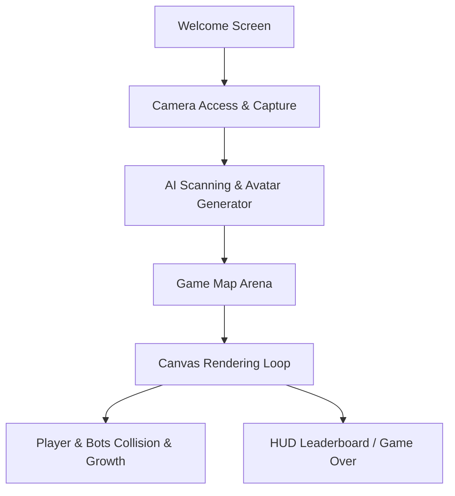

# Implementation Plan: AI Face-Emoji Agar.io Style Game

Create a premium, visually stunning web-based game in the style of Agar.io. The signature mechanic is that each player takes a camera snapshot of their face, which is processed through an "AI emoji creator" to become their cute, custom circular avatar. Players then enter a dynamic grid arena to eat food and consume other players/bots to grow as large as possible.

---

## User Review Required

> [!IMPORTANT]
> **Avatar Generation Strategy**
> Since this is a browser-based application running locally on your computer, true server-side AI image generation (e.g., via OpenAI's DALL-E 3) requires API keys and network configuration. We propose a hybrid approach to provide a premium, seamless, and functional experience out-of-the-box:
> 1. **Default Option: Dynamic Canvas Face-Styling & Vector Reconstruction**: The game will access the user's camera, take a picture, and run a client-side scan. It will analyze the dominant colors and facial structure to build a gorgeous, stylized vector avatar (with custom cute eyes, mouth, expressions, and accessories) customized to their photo. A stunning "AI Processing" grid animation will visualize the conversion.
> 2. **Optional API Integration**: We can provide a settings option where you can input an API key (e.g., OpenAI or Hugging Face) to use real text-to-image/image-to-image pipelines if you wish to run it live.
> *Please let us know your preference in the review response!*

> [!TIP]
> **Simulated Multiplayer (Bots) vs. Real-Time Multiplayer**
> For a local web game, **Simulated Multiplayer with intelligent Bots** provides an instant, lag-free, high-fidelity experience. Bots will navigate, eat food, run away from larger cells, and chase smaller cells. We will implement this as the primary mode, but can adapt it if you explicitly need a multiplayer server (e.g., via Socket.io).

---

## Open Questions

> [!IMPORTANT]
> 1. **AI Avatar Generation Style**: Do you prefer the client-side stylized vector conversion (zero setup, very fast, highly responsive, custom emojis based on face dominant colors/shapes) or would you like us to implement a connection to an AI API (like OpenAI's DALL-E) which requires you to provide an API key?
> 2. **Agar.io Mechanics**: Do you want classic split-mechanics (`Space` to split your cell and shoot forward) and eject-mass mechanics (`W` to shoot out mass)? Or should we keep the movement simple and focused on smooth movement and growth?
> 3. **Tech Stack Preference**: We plan to use a **Vite + HTML5 Canvas + Tailwind CSS/Vanilla CSS** setup. This allows us to keep it incredibly fast, with an efficient, modular development setup. Is this stack good, or do you have a preference for pure Vanilla HTML/CSS/JS with zero node module dependencies?

---

## Proposed Changes

We will construct the project in the workspace folder `c:\Users\lior\Documents\Sela Interview`.

### 1. Project Configuration & Framework

We will initialize a clean, modern Vite project to serve as the application base. This allows hot reloading, asset bundling, and clean TypeScript/ES6 organization.

#### [NEW] [package.json](file:///c:/Users/lior/Documents/Sela%20Interview/package.json)
Configures scripts, dependencies (Vite for development, Google Fonts for sleek styling, FontAwesome or lightweight icons if needed).

#### [NEW] [vite.config.js](file:///c:/Users/lior/Documents/Sela%20Interview/vite.config.js)
Sets up basic Vite dev-server config.

---

### 2. Styling & Core System

#### [NEW] [index.css](file:///c:/Users/lior/Documents/Sela%20Interview/index.css)
Implements a stunning dark-mode color scheme with fluid typography (`Outfit` and `Inter` from Google Fonts), glassmorphism overlay classes, glowing borders, custom keyframe animations for the AI "scanning" effect, and custom scrollbars.

---

### 3. Application HTML Structure

#### [NEW] [index.html](file:///c:/Users/lior/Documents/Sela%20Interview/index.html)
Main markup containing the app container. Structured with semantic tags:
- **Welcome Panel**: Glowing logo, name input, enter game controls.
- **Camera Screen**: Rounded webcam stream mask, "Capture Photo" button.
- **AI Processing Screen**: Processing state with grid scanner overlay, loading bars, and AI visual transform logs.
- **Game UI Overlay**: Leaderboard (top 5), current mass, minimap indicator, and touch/keyboard guides.
- **Game Canvas**: Fullscreen high-performance HTML5 `<canvas>`.
- **Game Over Modal**: Mass achieved, bots eaten, "Restart" CTA.

---

### 4. Game Logic & Engine

#### [NEW] [src/camera.js](file:///c:/Users/lior/Documents/Sela%20Interview/src/camera.js)
Manages webcam access via standard HTML5 API. Captures image frames to a hidden canvas, downscales/normalizes the photo, and handles error states (e.g., if no webcam is connected, falls back to custom avatar editor).

#### [NEW] [src/avatarGenerator.js](file:///c:/Users/lior/Documents/Sela%20Interview/src/avatarGenerator.js)
The core AI-simulating component:
- Scans the photo pixel matrix to determine dominant skin-tones, hair/background tones, and brightness.
- Generates a beautifully styled, high-quality **circular vector cute emoji** by assembling pre-designed canvas layers (cute eyes, cheeks, glasses, smiles, blush) tailored dynamically to the photo's profile.
- Renders this vector onto an offline canvas to serve as the player's high-res circular texture.

#### [NEW] [src/game.js](file:///c:/Users/lior/Documents/Sela%20Interview/src/game.js)
The core Agar.io game engine:
- **Game State**: Map boundaries, Player, Bots list, Food list, Particles list.
- **Game Loop**: Standard `requestAnimationFrame` driving update and render cycles.
- **Camera System**: Centers on the player with smooth interpolation (lerp). Incorporates dynamic zooming—as the player's circle radius grows, the viewport scales down so the player can see more of their surroundings.
- **Movement Physics**: Smooth vector movement chasing the cursor with inertia.
- **Bot Behavior**: 15 intelligent bot cells moving around, searching for nearby food, running away from larger cells, and attempting to corner smaller cells.
- **Collision Detection**: 
  - Quadtree structure or fast grid partitioning to handle hundreds of food dots and 20 players/bots at 60fps.
  - Mass-transfer logic when eating foods or other cells.
- **Visual Effects**: Soft jelly-like body wiggling on eating, floating particle bursts, eating audio triggers (Web Audio API synthesis for bubbly eating sounds).

#### [NEW] [src/main.js](file:///c:/Users/lior/Documents/Sela%20Interview/src/main.js)
Application orchestrator coordinating the transitions between Welcome -> Camera -> AI Transform -> Gameplay -> Game Over.

---

## Verification Plan

### Automated/Tool Verification
- Run Vite local server and verify there are no bundler or script compiling errors.
- Test the HTML canvas responsiveness and render speeds (checking frame rate displays at standard 60fps).

### Manual Verification
1. **Camera Validation**: Check camera permissions request, video stream resolution, circular masking, and snapshot snapshot freeze.
2. **AI Simulation Stage**: Verify visual quality of the "processing scanner", custom vector composite generation, and error-handling fallback if camera is blocked.
3. **Gameplay Mechanics**:
   - Check player movement follow direction of mouse cursor.
   - Verify food consumption increases player mass and circle scale.
   - Test bot collision: smaller cells get consumed, larger cells consume player/other bots.
   - Verify dynamic camera zooming as player grows.
   - Verify Leaderboard updates correctly in real-time.
4. **Game Over & Restart**: Confirm game reset works perfectly, maintaining state, returning player to main screen or restarting with new character settings.
